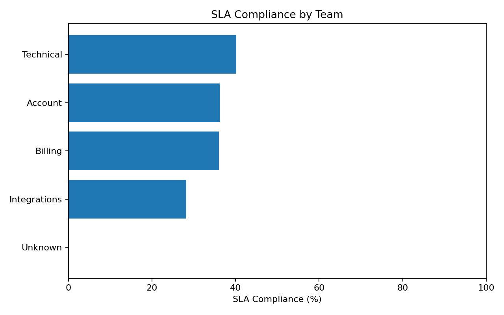
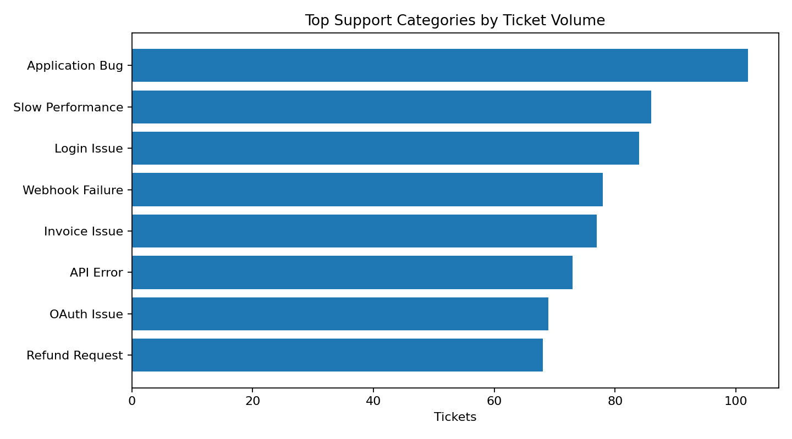
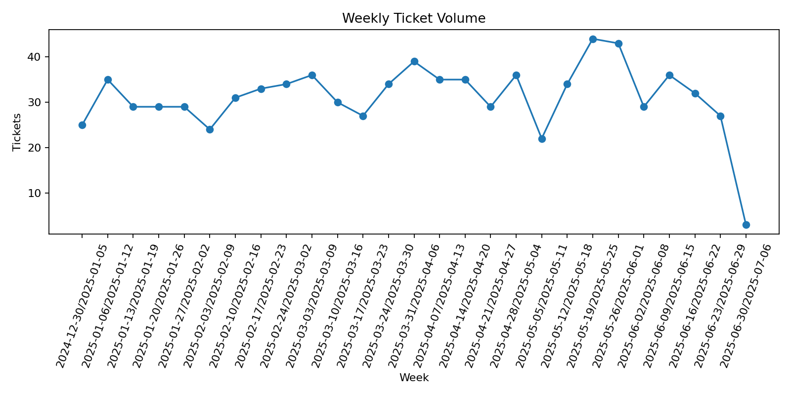

# Customer Support SLA & Data Quality Analysis

Beginner-friendly Data Analyst portfolio project using **Python, pandas, SQL, SQLite and Power BI-ready outputs**.

> Dataset is synthetic and contains no real customer information.

## Business Question

Which teams and issue categories are causing SLA breaches, slow resolution, low CSAT and ticket reopenings?

## Key Results

- Clean tickets analyzed: **840**
- SLA compliance: **34.99%**
- Average first response: **66.59 minutes**
- Average CSAT: **3.51/5**
- Lowest-SLA known team: **Integrations (28.18%)**
- Highest-volume issue: **Application Bug (102 tickets)**

## Skills Demonstrated

- CSV handling and multi-file merge
- Data cleaning and validation
- Date/time calculations
- SLA KPI logic
- Exploratory data analysis
- SQL aggregation and CASE statements
- Dashboard planning and DAX measures
- Business recommendations

## Charts







## Run Locally

```bash
python -m venv .venv
.venv\Scripts\activate
python -m pip install -r requirements.txt
python run_all.py
```

Mac/Linux activation: `source .venv/bin/activate`

## Main Files

- `data/raw/` — dirty tickets and SLA target lookup
- `src/clean_data.py` — cleaning, rejection rules and SLA calculations
- `src/analyze_data.py` — KPI tables and charts
- `src/run_sql_demo.py` — executable SQLite demo
- `sql/analysis_queries.sql` — interview-ready SQL
- `notebooks/analysis_walkthrough.ipynb` — step-by-step notebook
- `powerbi/POWER_BI_GUIDE.md` — visuals and DAX
- `docs/INTERVIEW_EXPLANATION_HINGLISH.md` — project viva preparation

## Project Flow

`Raw CSVs -> Cleaning & Validation -> Merge -> SLA Metrics -> EDA -> SQL -> Dashboard-ready output`

## Important

Read `START_HERE_HINGLISH.md` before running and `GITHUB_UPLOAD.md` before publishing.
